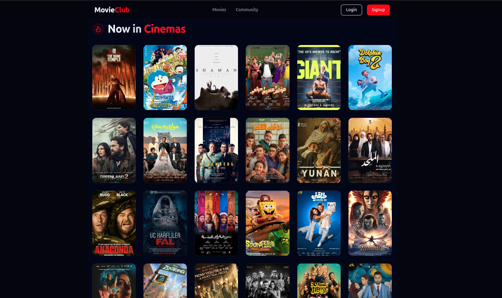
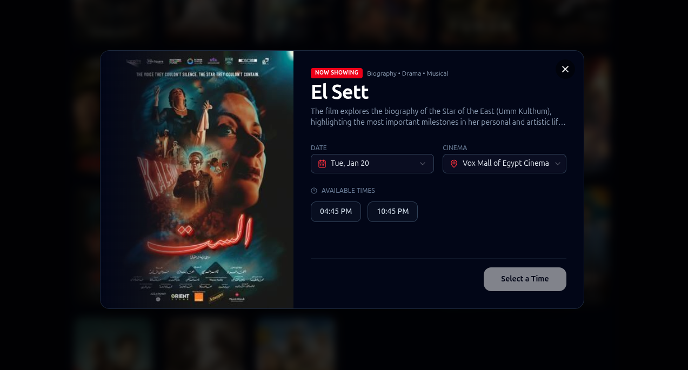
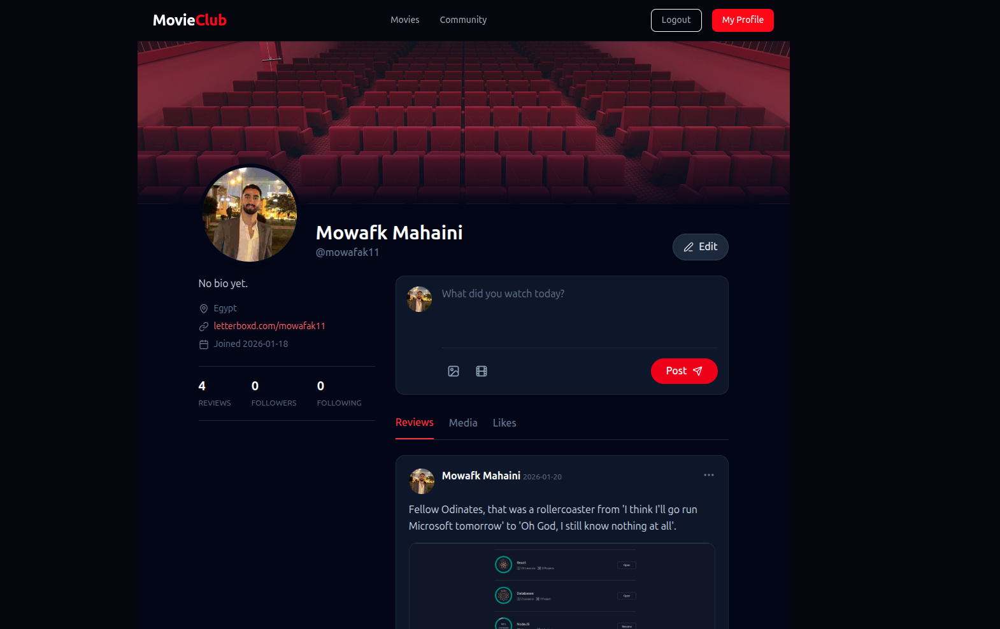
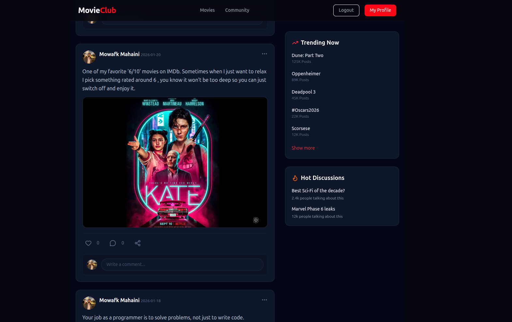
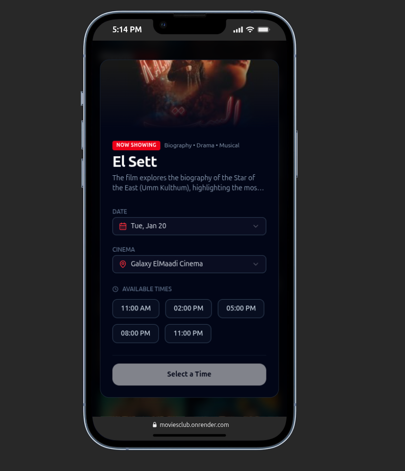
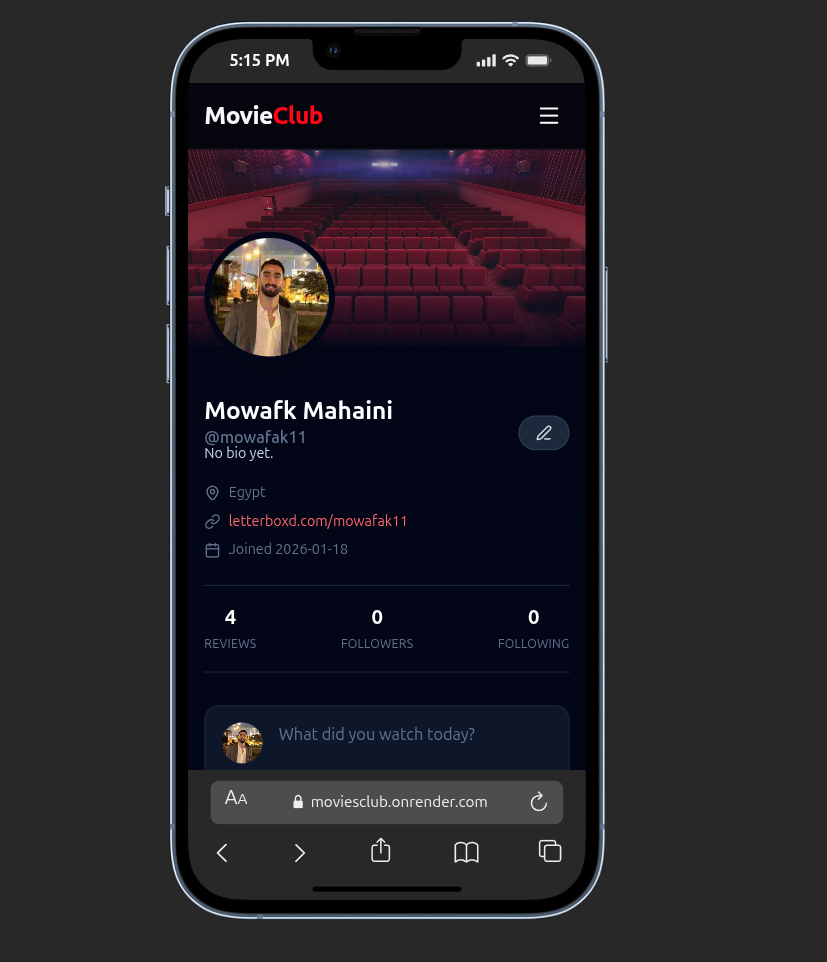
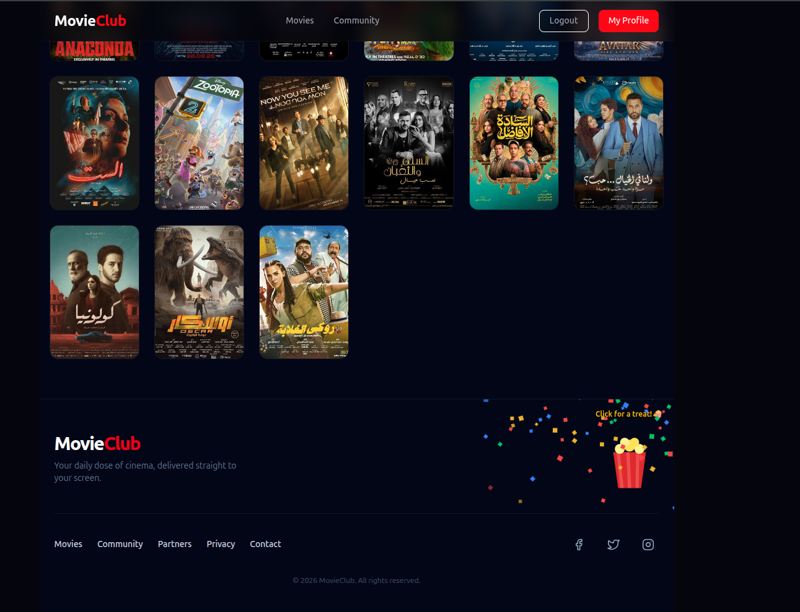

# MovieClub

A full-stack social platform for movie lovers to share reviews,and track real-time cinema listings. This project is part of my Fullstack learning journey 

## Stack

**Frontend:**

**Backend:**

**Database:**

---

## Features
* **Real-Time Showtimes:** Displays live movie showtimes by scraping data directly from local Egyptian cinemas. Users can see exactly when and where a movie is playing.
* **Social Feed:** Post movie reviews, like posts, and interact with a community of movie lovers.
* **Profile Customization:** Upload and crop profile images.
* **Optimistic UI:** Instant feedback on likes and follows for a snappy, modern feel.
* **Fully Responsive:** A "mobile-first" layout designed to provide a seamless experience on any device.
---
